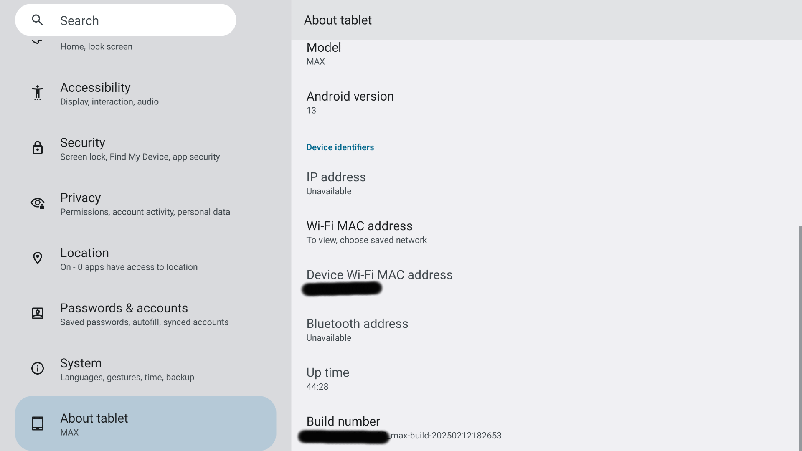

# SkylightMaxCalendarADB
Walkthrough of how to enable ADB on the Skylight Calendar Max, install a navigation bar, app launcher, and Aurora App Store.

# Support
If you find this tutorial helpful and wish to support, it would be greatly appreciated.

## AMAZON
You can email me an amazon giftcard to dinewby88@gmail.com

https://a.co/d/g2UFe8B

## VENMO
https://venmo.com/u/dinewby88


## PAYPAL
https://paypal.me/DavidNewby


# Instructions
1. Connect your device to power and to your PC via USB-C cable.
2. Hold the power button on the back of the device for approx 2 sec until the "Power off/Restart" options come up:
   
3. Pull down with 2 fingers from the top. You may get a **standard** pop-up with options like "Lockdown", "Power off", and "Restart".
4. Continue to repeat steps 4 and 5 until you get an **error** pop-up stating "System UI keeps stopping":
5. Tap "App Info" - this will bring you to the system menu. Scroll down to "About tablet", and scroll down to "Build number".
   
6. Tap "Build number" 7x and you will be able to enter developer mode.
7. Go to `System > Developer Options > USB debugging`, and enable to allow for further ADB commands and side loading apps.
   
8. Download, Install, and Launch [Android Studio](https://developer.android.com/studio) (I got android-studio-2024.3.2.15-windows) (I believe launching it the first time is required to actually get ADB installed.)
9. Run `cmd.exe`
10. In command prompt:`cd %LOCALAPPDATA%\Android\sdk\platform-tools`
11. NOTE: From now on, you can enter `adb shell am start -a android.settings.SETTINGS` to get to the settings app if you get stuck in the Skylight App again.
12. Now, we can install some apps.
13. [Nova Launcher](https://www.apkmirror.com/apk/teslacoil-software/nova-launcher/nova-launcher-8-1-1-release/) - Download and save the *.apk file to `%LOCALAPPDATA%\Android\sdk\platform-tools`
14. In command prompt:

    ```
    >adb install nova-launcher-8-1-1.apk
    Performing Streamed Install
    Success
    ```
15. Repeat steps 13-14 for [Navigation Bar](https://apkpure.com/navigation-bar-for-android/nu.nav.bar/download)
16. Repeat steps 13-14 for [Aurora Store](https://www.apkmirror.com/apk/aurora-oss/aurora-store-gitlab-version/aurora-store-gitlab-version-4-7-3-release/)
17. In Android, go to `Settings > Default apps > Home app > Nova Launcher`.
18. In Android, go to `Settings > Accessibility > Navigation Bar > Use Navigation Bar`, and enable.
    
19. In Android, go to `Settings > Apps > Special app access > Display over other apps > Navigation Bar > Allow display over other apps`, and enable.
20. In Android, go to `Settings > Apps > Navigation Bar > Open` and accept the "Accessibility Service Usage" terms.
    
21. In command prompt:

    ```
    >adb reboot
    Performing Streamed Install
    Success
    ```
22. Now, when it reboots, the 'home app' will be the Nova Launcher, and you will have a navigation bar at the bottom. Click the middle circle button on the Navigation Bar to bring up your apps in Nova Launcher.
    
    You can select Skylight and use it as normal. Swipe down on the nav bar to hide it, swipe up to bring it back.
    
23. Connect to Wi-Fi under "Settings" app.
24. Launch Aurora Store, log in under anonymous, get whatever apps you want.

NOTE: This is fully reversible. If you hold the power button for 10 seconds, it will initiate a Factory Reset and all of these changes will be cleared.

Again, If you find this tutorial helpful and wish to support, it would be greatly appreciated. Links [above](#Support).
